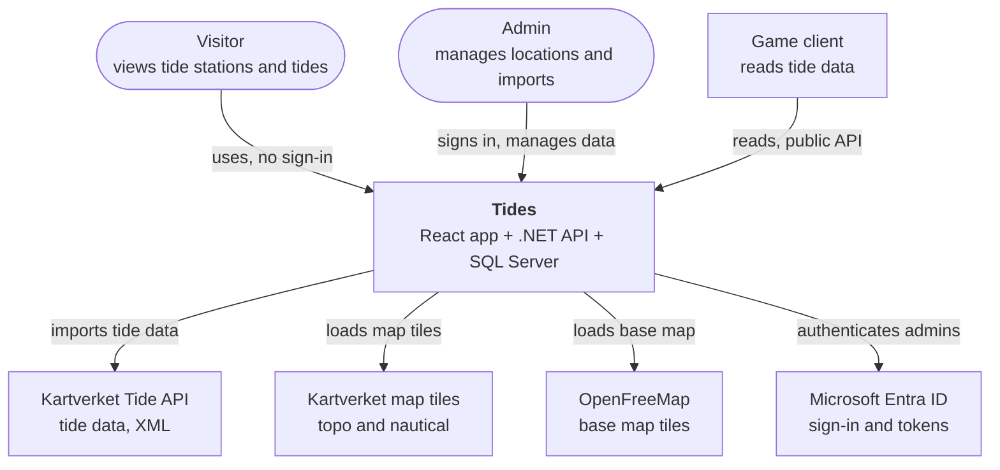

# Architecture

The system being built, shown as a context diagram: Tides and the people and systems it interacts with.

## Context

| Element | Role |
| --- | --- |
| Visitor | Anyone. Reads tide data without signing in. |
| Admin | Signs in with Entra ID and needs the `Admin` role to manage locations and imports. |
| Game client | Reads tide data through the public, versioned API. Holds no keys or secrets. |
| Tides | Imports tide data from Kartverket, stores it and serves it as JSON. |
| Kartverket Tide API | Source of tide data. Free, no key, licensed CC BY 4.0. |
| Kartverket map tiles | Topo map and nautical chart drawn over the base map, loaded directly by the browser. Free, no key. |
| OpenFreeMap | Base map under the Kartverket tiles, from OpenStreetMap data. Shows where Kartverket has no coverage or its tiles fail to load. Free, no key. |
| Microsoft Entra ID | Signs in admins and issues the tokens the API checks. |
